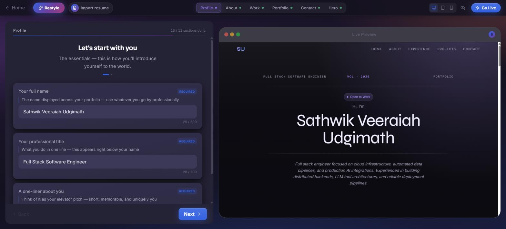
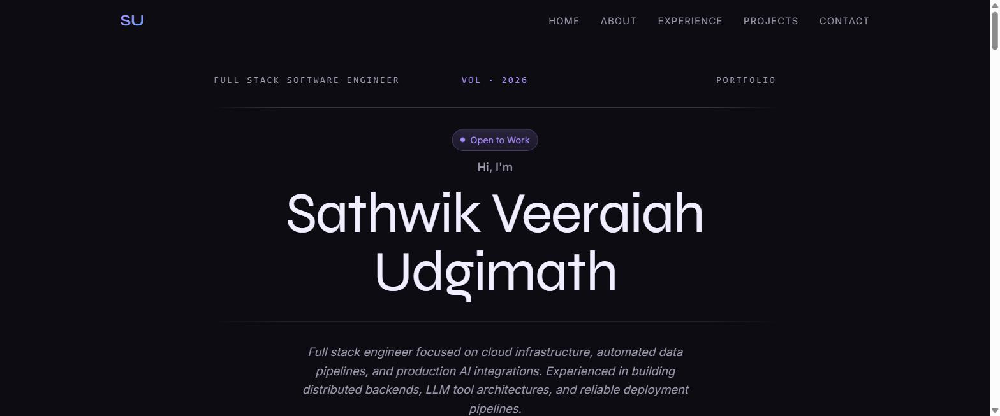
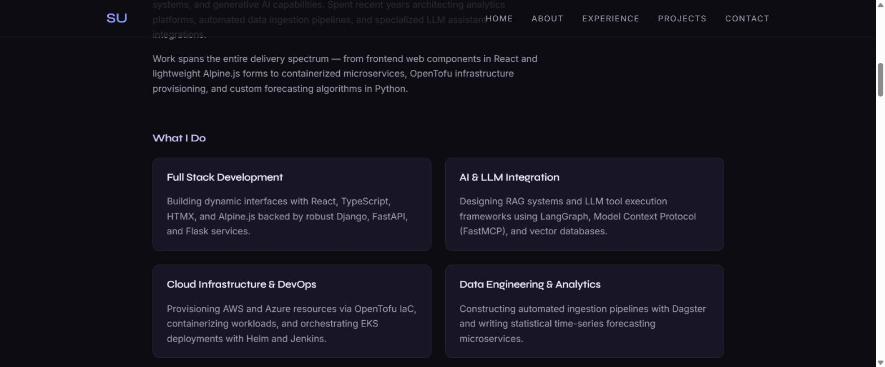
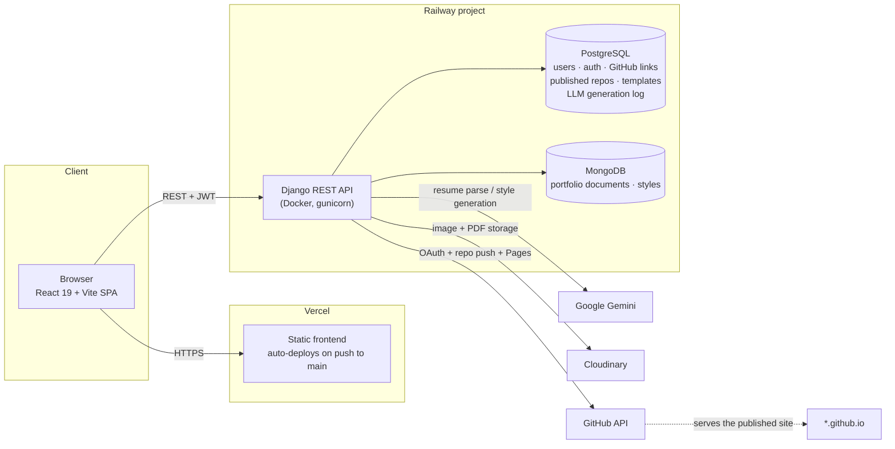

<p align="center">
  
</p>

<h1 align="center">Dzigned</h1>
<p align="center"><b>Build a portfolio. Generate a style with AI. Publish it to your own GitHub Pages site.</b></p>

<p align="center">
  <a href="https://portfolio-builder-sandy.vercel.app">Live App</a> ·
  <a href="https://portfoliobuilder-production-942d.up.railway.app/health">API Health</a> ·
  <a href="./dzigned-api-contract.md">API Contract</a> ·
  <a href="./TEMPLATE_REFERENCE.md">Template Reference</a>
</p>

<p align="center">
  
  
  
  
  
  
  
  
  
  
</p>

---

## What it does

Dzigned is a full-stack SaaS product: a user signs up, fills in a guided portfolio editor (or uploads a
resume PDF and lets an LLM parse it into structured sections), generates a custom visual style from a text
prompt, previews the result live, and publishes it — the backend creates a real repository on the user's
GitHub account via OAuth, pushes the rendered template and their data into it, and turns on GitHub Pages,
so the finished site is live at `https://<user>.github.io/<repo>` under their own account, not a
Dzigned-hosted URL.

Everything below — API, both databases, AI integration, auth, and the Docker/Railway/Vercel deployment —
was designed and built end-to-end for this project.

## Demo — resume import → live portfolio

Upload a resume PDF and Gemini parses it into structured sections that prefill the guided editor,
live preview included:

<p align="center">
  
</p>

...and here's the result, published to the user's own GitHub Pages site with one click:
[svudgimath.github.io/dzigned-portfolio-svudgimath-2](https://svudgimath.github.io/dzigned-portfolio-svudgimath-2/)

<p align="center">
  
  <br><br>
  
</p>

## Highlights

- **Two purpose-fit databases, not one default.** PostgreSQL holds relational/transactional data (users,
  auth, GitHub links, published-repo records, template catalog, LLM generation log); MongoDB holds
  schema-flexible document data (portfolio content, AI-generated style JSON) that changes shape per
  section and doesn't benefit from a rigid relational schema.
- **Real AI integration, not a demo wrapper.** Google Gemini powers both resume parsing (PDF → structured
  portfolio JSON) and on-demand style generation, with per-minute/per-day rate limiting backed by a
  Postgres generation log, retry-with-backoff on transient failures, and typed error responses
  (`rate_limit_minute`, `service_busy`, `service_timeout`, …) the frontend can react to individually
  instead of a generic failure message.
- **Hand-rolled JWT, deliberately.** Auth uses PyJWT instead of a framework's default JWT library so the
  token claims (`sub`, `email`, `type`, HS256) exactly match what the frontend already expects — matching
  an existing contract mattered more than a library's own conventions.
- **A GitHub App integration that does real work.** Publishing isn't a static export: it authenticates via
  OAuth, creates (or updates) a repository through the GitHub API, pushes the compiled template and the
  user's portfolio/style data as base64-encoded file commits, and enables Pages — all server-side, on the
  user's behalf.
- **Production-hardened, not just "works on my machine."** Django settings fail fast at startup if
  `DEBUG=False` and any secret is still its insecure dev default; HSTS, secure cookies, and SSL-redirect
  are on in production; a custom middleware answers the platform health check *before* Django's
  `ALLOWED_HOSTS` validation runs, because Railway's internal health probe doesn't send the public domain
  as its `Host` header — a real bug found and fixed during deployment, not a hypothetical.
- **383 automated backend tests** covering auth, throttling, exception-handler shape, LLM failure/retry
  paths, and even a timezone-awareness regression in the Mongo client (naive vs. aware datetimes silently
  breaking comparisons).

## Architecture



The frontend and backend are decoupled and independently deployed: the SPA talks to the API purely over
`fetch`/`axios` + a bearer JWT, with no server-side rendering or shared runtime. Both auto-deploy from the
same GitHub repo — push to `main` and Vercel rebuilds the frontend while Railway rebuilds and redeploys the
API container.

## Tech stack

| Layer | Stack |
|---|---|
| **Frontend** | React 19, Vite, React Router 7, Tailwind CSS 4, Framer Motion, React Hook Form, Axios |
| **Backend** | Python 3.12, Django 5.2, Django REST Framework, PyJWT, bcrypt, httpx |
| **Relational data** | PostgreSQL (via Django ORM) |
| **Document data** | MongoDB (via `pymongo`, no ODM) |
| **AI / LLM** | Google Gemini (`google-genai`) — resume parsing + style generation |
| **File storage** | Cloudinary (images, resume PDFs) |
| **External integration** | GitHub OAuth + REST API (repo creation, file commits, Pages) |
| **Containerization** | Docker (multi-stage-ready single image, non-root user, gunicorn) |
| **Hosting** | Railway (API + Postgres + MongoDB, one project) · Vercel (frontend, edge CDN) |
| **Testing** | Django `TestCase` / DRF `APITestCase` — 383 tests, unit + integration |

## How it works

1. **Auth** — email/password signup and login, stateless JWT access + refresh tokens.
2. **Build a portfolio** — a guided, section-by-section editor (12 sections: hero, about, skills,
   experience, education, projects, certifications, research, contact, footer, …), or **import from a
   resume PDF**, which the backend extracts text from and hands to Gemini to return structured JSON that
   prefills the editor.
3. **Generate a style** — describe a look in plain English ("warm editorial serif, muted palette"); Gemini
   returns a structured theme (colors, fonts, spacing) that's saved and can be activated, regenerated, or
   deleted, rate-limited per user per day.
4. **Live preview** — the backend server-renders the active template with the user's real data for an
   in-editor iframe preview.
5. **Publish** — connect GitHub via OAuth, pick a repo name, and the backend creates/updates the repo,
   commits the template + the user's data as JSON, and turns on GitHub Pages — the live site is served
   directly from the user's own GitHub account.

## Project structure

```
PortfolioBuilder/
├── frontend/                     React 19 + Vite SPA (Vercel)
│   └── src/
│       ├── pages/                Route-level pages (Dashboard, Editor, Publish, Auth)
│       ├── components/           Guided editor, style popover, layout, forms
│       ├── auth/                 AuthContext, ProtectedRoute
│       └── api/                  Thin axios wrappers per backend module
│
├── portfolio-builder-backend-py/ Django REST Framework API (Railway)
│   ├── core/                     JWT service, DRF auth class, exception handler, Mongo client, health middleware
│   ├── accounts/                 Signup / login / refresh
│   ├── portfolio/                Portfolio CRUD (Mongo) + resume import (LLM)
│   ├── styles/                   Style CRUD + AI style generation (LLM), rate limiting
│   ├── files/                    Cloudinary upload/delete
│   ├── github_auth/              GitHub OAuth connect flow
│   ├── publish/                  Repo creation, file push, Pages enablement
│   ├── dashboard/                Read-only aggregation endpoint
│   ├── preview/                  Public live-preview + template SPA shell
│   ├── Dockerfile                Production image (gunicorn, non-root)
│   └── docker-compose.yml        Local Postgres + MongoDB
│
├── dzigned-api-contract.md       Full REST API reference
└── TEMPLATE_REFERENCE.md         Portfolio template data schema + rendering rules
```

## Local development

```bash
# 1. Backend — Postgres + MongoDB via Docker, then Django
cd portfolio-builder-backend-py
docker-compose up -d
python -m venv venv && ./venv/Scripts/python.exe -m pip install -r requirements.txt
cp .env.example .env
./venv/Scripts/python.exe manage.py migrate
./venv/Scripts/python.exe manage.py seed_templates
./venv/Scripts/python.exe manage.py runserver 8080

# 2. Frontend
cd ../frontend
npm install
npm run dev
```

Full setup, `.env` reference, and testing instructions: [`portfolio-builder-backend-py/README.md`](./portfolio-builder-backend-py/README.md).

## Deployment & infrastructure

- **Backend** ships as a single production Docker image (Python 3.12-slim, gunicorn, non-root user,
  `$PORT`-aware) deployed on **Railway** in a project alongside managed **PostgreSQL** and **MongoDB**
  instances, wired together with Railway's variable references — no connection strings hardcoded anywhere.
- **Frontend** is a static Vite build deployed on **Vercel**, pointed at the Railway API via a single
  build-time env var (`VITE_API_BASE_URL`).
- **CI/CD is push-based**: both platforms watch the same GitHub repo and rebuild/redeploy automatically on
  push to `main` — no separate pipeline config to maintain.
- **Health checks**: `/health` on the API checks live Postgres connectivity (deliberately skipping
  Mongo/Cloudinary/Gemini so a slow third party can't flap the check) and answers from a first-position
  Django middleware so platform-internal health probes never get tangled up in host-header validation.
- Full step-by-step deploy guide (env vars, secrets, migration release step, verification):
  [`portfolio-builder-backend-py/README.md`](./portfolio-builder-backend-py/README.md#production-deployment).
